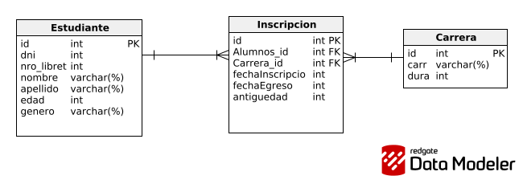

# Trabajo Práctico Especial :computer:


## Primera entrega:

- [x] Proyecto Java orientado a la persistencia de datos usando **JDBC** y **DAO pattern**.
- [x] Gestión de entidades (Productos, Compras, etc.) conectadas a una base de datos **MySQL**.

---

### Tabla de Contenidos
- [Descripción](#descripción)
- [Arquitectura](#arquitectura)
- [Requisitos](#requisitos)
- [Instalación](#instalación)
- [Uso](#uso)
- [Estructura del Proyecto](#estructura-del-proyecto)
- [Autores](#autores)

---

### Descripción
Este proyecto corresponde al **Trabajo Práctico Especial** de la materia.  
Se centra en la implementación de un **sistema CRUD** para la gestión de productos y compras usando **Java, JDBC y MySQL**.

El objetivo es aprender a:
- Conectarse a una base de datos.
- Manipular entidades con **DAO (Data Access Object)**.
- Ejecutar operaciones **CRUD (Create, Read, Update, Delete)**.

---

### Arquitectura
- **Lenguaje:** Java 22
- **Persistencia:** JDBC con MySQL | Derby | Postgres
- **Gestión de dependencias:** Maven
- **Patrón usado:** DAO

---

### Requisitos
Antes de instalar el proyecto, asegurate de tener:
- [Java JDK 22+]
- [Apache Maven](https://maven.apache.org/)
- [MySQL 8]
- Docker (opcional, si querés levantar la DB en contenedor)

---

### Instalación

1. Clonar el repositorio:
```bash
git clone https://github.com/MatiasBavacc/TrabajoPracticoEspecial.git
cd TrabajoPracticoEspecial
```

2. Crear la base de datos (ejemplo):
```sql
CREATE DATABASE integrador1;
```

### Uso

### Estructura del Proyecto
```
src/
 └── main/java/dao         # Clases DAO (ProductoDao, CompraDao, etc.)
 └── main/java/entities    # Entidades del sistema (Producto, Compra)
 └── main/java/factory     # Conexion con la db
 └── main/java/main        # Pruebas de funcionamiento
 └── main/java/utils       # Utilidades para llenar la db
 └── main/resources        # Archivos de configuración (scv)
```

---

## Segunda entrega:


### Tabla de Contenidos
- [Descripción](#descripción)
- [Servicios que provee la aplicación](#Servicios que provee la aplicación)
- [Tecnologías utilizadas](#Tecnologías utilizadas)
- [Diagramas](#Diagramas)
- [Autores](#autores)

---

## Descripción: 
- [x] El trabajo consiste en la implementación de consultas **JPQL** utilizando **JPA**.

## Servicios que provee la aplicación:
- Dar de alta un estudiante.
- Matricular un estudiante en una carrera.
- Recuperar todos los estudiantes, y especificar algún criterio de ordenamiento simple.
- Recuperar un estudiante, en base a su número de libreta universitaria.
- Recuperar todos los estudiantes, en base a su género.
- Recuperar las carreras con estudiantes inscriptos, y ordenar por cantidad de inscriptos.
- Recuperar los estudiantes de una determinada carrera, filtrado por ciudad de residencia.
- Generar un reporte de las carreras, que para cada carrera incluya información de los inscriptos y egresados por año. Se deben ordenar las carreras alfabéticamente, y presentar los años de manera cronológica.

## Tecnologías utilizadas
JPA (Proveedor: Hibernate), JPQL
MySQL
Patrones de arquitecturas web: Factory Method, Abstract Factory, DTO, Repository.

## Diagramas
Presentamos los siguientes diagramas a modo de entender la relacion entre clases y entidades y el mapeo de hibernate con la base.
### Diagrama Entidad-Relacion
Visto desde la base de datos

### Diagrama UML 
Visto desde el punto de vista de Objetos


## Autores

| Nombre    | Apellido | DNI        | E-mail                       | Sede   |
|-----------|----------|------------|------------------------------|--------|
| Matías    | Bava     | 38.961.362 | matiasbavacc@gmail.com       | Tandil |
| Alejandro | Garay    | 18.038.228 | alejandrogaray1966@gmail.com | Tandil |
| Agustin   | Rypstra  | 42.117.730 | agusrypstra@gmail.com        | Tandil |
| Valentin  | Navarro  | 43.905.978 | valentinnavarro888@gmail.com | Tandil |